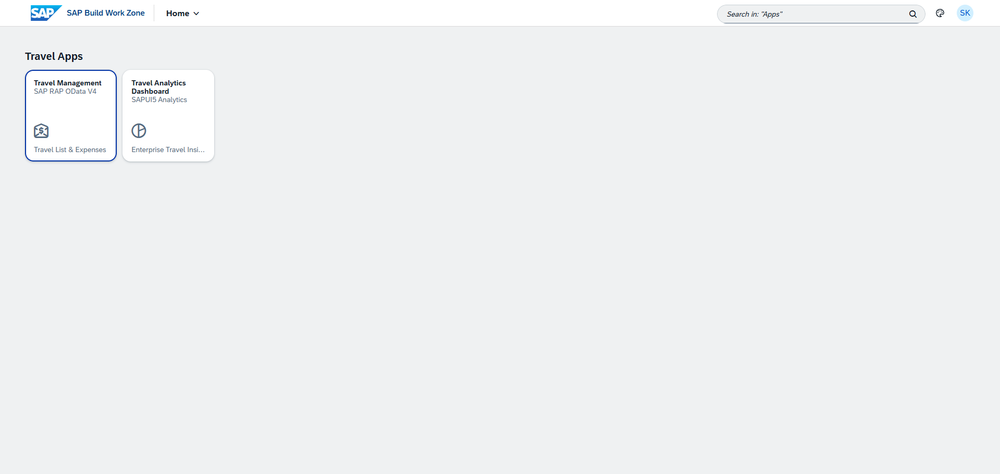
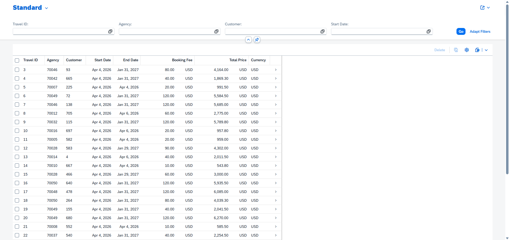
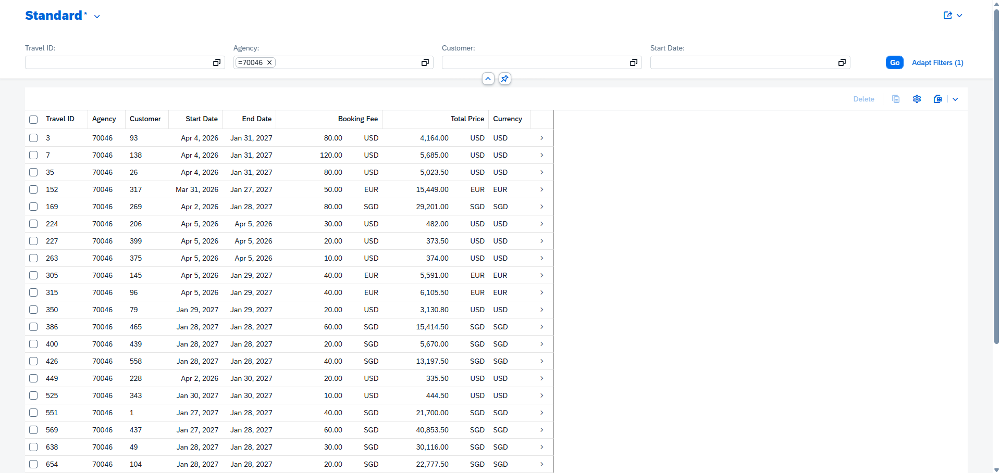
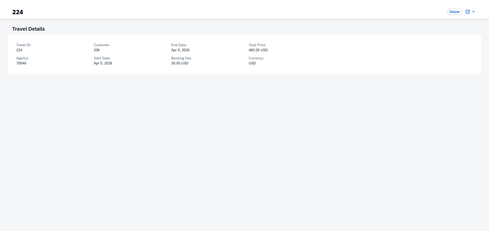
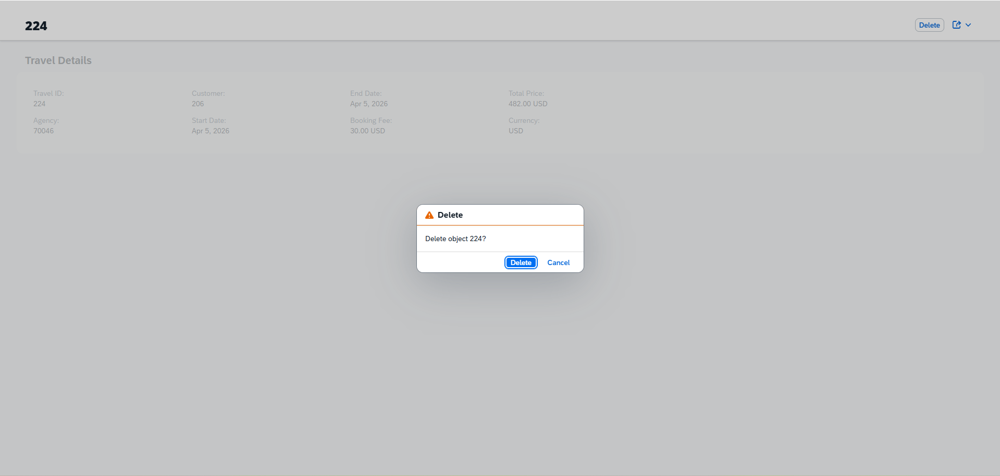
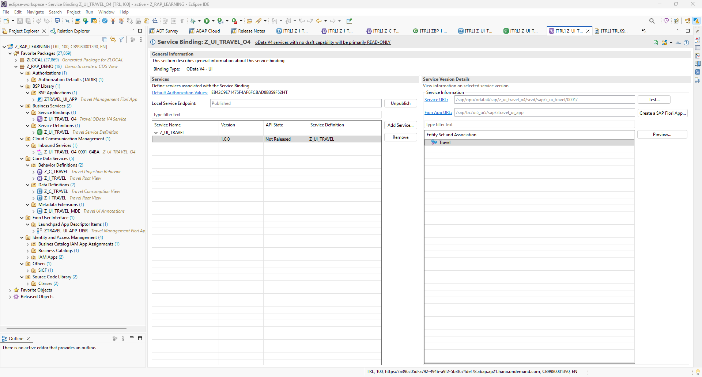

# Travel Management (SAP RAP)

An enterprise-grade **Travel Management** application built using **SAP RAP (ABAP RESTful Application Programming Model)** on **SAP BTP ABAP Environment**.

The application was developed in **Eclipse ADT (ABAP Development Tools)** using RAP, CDS View Entities, Behavior Definitions, OData V4 Services, and SAP Fiori Elements. It is deployed to **SAP Build Work Zone**, providing a complete end-to-end enterprise application lifecycle.

This project demonstrates modern SAP backend development, service exposure, Fiori application generation, launchpad integration, and enterprise deployment using SAP BTP.

**Highlights:** SAP RAP · ABAP Cloud · CDS View Entity · Behavior Definition · OData V4 · SAP Fiori Elements · Eclipse ADT · SAP Build Work Zone

---

## Project Introduction

The Travel Management application is a transactional SAP Fiori application built using the SAP RESTful Application Programming Model (RAP).

The project exposes travel data through an **OData V4** service generated from RAP business objects. Using the published service binding, a SAP Fiori Elements List Report and Object Page application was generated directly from Eclipse ADT and deployed to SAP Build Work Zone.

The backend is implemented using SAP RAP business objects, while the frontend follows the SAP Fiori Elements programming model, minimizing custom UI code and leveraging SAP's standard UX patterns.

---

## Architecture


---

## Development Flow

```text
SAP BTP ABAP Environment
        │
        ▼
Root CDS View (Z_I_TRAVEL)
        │
        ▼
Behavior Definition
        │
        ▼
Projection CDS View (Z_C_TRAVEL)
        │
        ▼
Projection Behavior
        │
        ▼
Service Definition (Z_UI_TRAVEL)
        │
        ▼
Service Binding (Z_UI_TRAVEL_O4)
        │
        ▼
SAP Fiori Elements
(List Report + Object Page)
        │
        ▼
BSP Application
        │
        ▼
SAP Build Work Zone
```

---

## Technology Stack

| Layer | Technology |
|--------|------------|
| Backend | SAP BTP ABAP Environment (ABAP Cloud) |
| Programming Model | SAP RAP |
| Data Modeling | CDS View Entities |
| Business Logic | Behavior Definitions |
| Service Layer | OData V4 |
| Frontend | SAP Fiori Elements |
| Development Tool | Eclipse ADT |
| Deployment | BSP Application |
| Identity | IAM App, Business Catalog, Role Collection |
| Launchpad | SAP Build Work Zone |

---

## SAP Objects

| Object Type | Object Name |
|--------------|-------------|
| Package | `Z_RAP_DEMO` |
| Root CDS View | `Z_I_TRAVEL` |
| Projection CDS View | `Z_C_TRAVEL` |
| Metadata Extension | `Z_UI_TRAVEL_MDE` |
| Behavior Definition | `Z_I_TRAVEL` |
| Projection Behavior | `Z_C_TRAVEL` |
| Service Definition | `Z_UI_TRAVEL` |
| Service Binding | `Z_UI_TRAVEL_O4` |
| Entity | `Travel` |
| BSP Application | `ZTRAVEL_UI_APP` |
| IAM App | `Z_TRAVEL_APP_EXT` |
| Business Catalog | `Z_TRAVEL_CATALOG` |
| Role Collection | `Z_TRAVEL_ROLE` |

---

## Key Features

- SAP RAP managed business object
- CDS View Entity based data model
- OData V4 service exposure
- SAP Fiori Elements List Report
- SAP Fiori Elements Object Page
- Search and Filter support
- Delete operation
- Responsive SAP Fiori UI
- SAP Build Work Zone integration
- Enterprise authorization configuration using IAM and Business Catalog

---

## Development Process

1. Created an ABAP Cloud Project using Eclipse ADT connected to SAP BTP ABAP Environment.
2. Developed the Root CDS View (`Z_I_TRAVEL`) using the standard `/DMO/TRAVEL` data source.
3. Implemented RAP Behavior Definitions for the business object.
4. Built the Projection CDS View (`Z_C_TRAVEL`) and Projection Behavior.
5. Added UI annotations using Metadata Extensions.
6. Created the Service Definition (`Z_UI_TRAVEL`).
7. Published the Service Binding (`Z_UI_TRAVEL_O4`) as an OData V4 UI service.
8. Generated the SAP Fiori Elements application directly from the Service Binding.
9. Deployed the generated BSP Application.
10. Configured IAM Application, Business Catalog, and Role Collection.
11. Published the application in SAP Build Work Zone.
12. Verified end-to-end functionality including filtering, navigation, Object Page, and delete operation.

---

## Screenshots

### SAP Build Work Zone



---

### List Report



---

### Search & Filter



---

### Object Page



---

### Delete Confirmation



---

### Service Binding



---

## Demo Video

A complete walkthrough demonstrating:

- SAP Build Work Zone
- Launchpad Navigation
- List Report
- Search & Filter
- Object Page
- Delete Operation
- Eclipse ADT Project Structure
- RAP Objects
- Service Binding

```text
video/travel-management-demo.mp4
```

---

## Deployment

The application was deployed using the following SAP BTP components:

- Eclipse ADT
- SAP BTP ABAP Environment
- BSP Application
- IAM Application
- Business Catalog
- Role Collection
- SAP Build Work Zone

---

## Challenges & Solutions

### 1. CDS View activation issues

Resolved annotation and projection inconsistencies while activating CDS View Entities.

---

### 2. Metadata Extension configuration

Configured UI annotations to expose fields correctly in the generated Fiori Elements application.

---

### 3. OData V4 Service Binding

Published and tested the generated OData V4 service before application generation.

---

### 4. SAP Build Work Zone Integration

Configured IAM Application, Business Catalog, and Role Collection to expose the application securely through SAP Build Work Zone.

---

### 5. Trial Environment Limitations

The SAP BTP Trial environment restricts certain enterprise capabilities such as full draft persistence and advanced administrative configurations. The project was designed to work within these limitations while demonstrating the complete RAP development workflow.

---

## Related Project

This backend application powers a companion SAPUI5 analytics solution.

👉 **Travel Analytics Dashboard**

https://github.com/SASIPKP/travel-analytics-dashboard

---

## Author

### Sasi Kumar

**SAP UI5 Developer | SAP RAP Developer | UX/UI Designer**

Building enterprise applications using SAPUI5, SAP RAP, SAP BTP ABAP Environment, OData V4, Cloud Foundry, SAP Build Work Zone, and SAP Fiori technologies.
